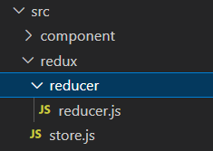

## redux 설치

react 에서 redux를 사용하고자 할 때는

- redux
- react-redux

모두 설치해줘야 한다.

    npm install redux
    npm install react-redux

configureStore 를 권장하고 있지만 일단은 옛날 버전 메서드인 createStore 먼저 사용해본다.

## redux 동작 원리

- 컴포넌트에서 reducer에게 action으로 동작을 넘겨줌 (이 때 dispatch가 사용됨)
- reducer는 store에게 return 값으로 전달해서 store에 state를 저장
- store에 저장된 state들을 컴포넌트에서 불러서 씀 (useSelector 사용)

## 차근차근 튜토리얼 해보기

### index.js 세팅

        import { Provider } from 'react-redux';
        import store from './redux/store';
        const root = ReactDOM.createRoot(document.getElementById('root'));
        root.render(
        <Provider store={store}>
            <App />
        </Provider>

- App.js 를 Provider로 감싸준다. (react-redux에서 불러와야함)
- Provider 는 props 로 store를 가진다. (store에서 state들을 관리)

### store는 지금 없다 -> 만들어주자

- redux라는 폴더에 store.js를 만들어준다.

### store 세팅

        import { createStore } from "redux";
        import reducer from "./reducer/reducer";

        let store = createStore(reducer);
        export default store;

- store는 reducer 에서 return해주는 값을 저장해주므로 reducer를 만들러 가자

### 버튼을 클릭하면 증가, 감소하는 state를 redux로 만들어보기

-  초기 state를 저장

    let initialState = {
    count: 0,
    }

- reducer(state= 초기state, action)
- 두개의 매개변수를 받으며, action은 컴포넌트에서 dispatch로 넘겨준 객체
- 여기서 action은 {type,payload} 으로 오며, type은 action을 구분하는 필수요소, payload는 조건등을 정하는 선택사항이다.

    function reducer(state=initialState,action) {}

### reducer 전체코드

    function reducer(state=initialState,action) {
    if(action.type === "DECREMENT"){
        return {...state, count : state.count - action.payload.num};
    }

        return {...state};
    }

    export default reducer;

- {...state, count : ~~~} 를 해주는 이유는 바뀐 초기 state를 계속
바꿔서 저장해서 store에 저장하기 때문이다. state를 받고, 그 받은 객체에서 변경하고자 하는 state만 조건에 따라 변경해서 다시 return으로 store에 저장하고 받고 하는 방식. 그러니까 {...state, state.count : ~~} 이런 식으로 바보같이 쓰지말자.

### 컴포넌트 에서의 dispatch와 useSelector 사용법

    import { useDispatch, useSelector } from 'react-redux';
    function App() {
    const count = useSelector(state=>state.count); 
    const dispatch = useDispatch();
    
    const increase = () => {
        dispatch({
        type: "INCREMENT",
        payload: {num:5}
        })
    }

    const decrease = () => {
        dispatch({
        type: "DECREMENT",
        payload: {num:5}
        })
    }
    return (
        

            <h1>{count}</h1>
            <button onClick={increase}>증가</button>
            <button onClick={decrease}>감소</button>
            <Box/>
        

    );
    }
